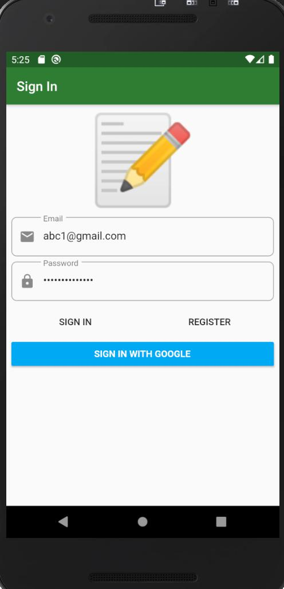
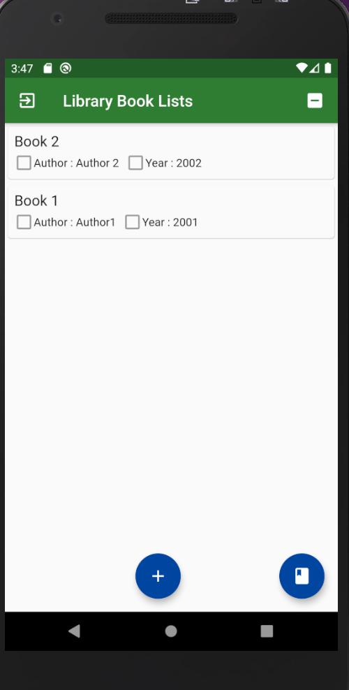
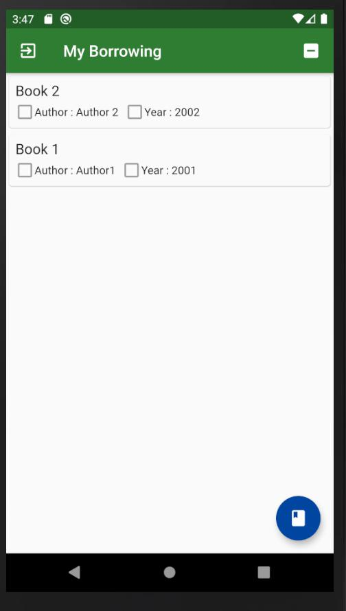

## Tasks

Create a library app using Flutter. The app should be able to:

2.1 Register as a new user

2.2 Login

2.3 Borrow a book

2.4 Show a list of borrowed books

2.5 Show the details of a borrowed book:

2.5.1 Name

2.5.2 Author

2.5.3 Borrowed date

2.5.4 Remaining time to return

2.6 Return a borrowed book

## Progress 1

Login Page 

Book Lists Page

Borrowing Lists Page

